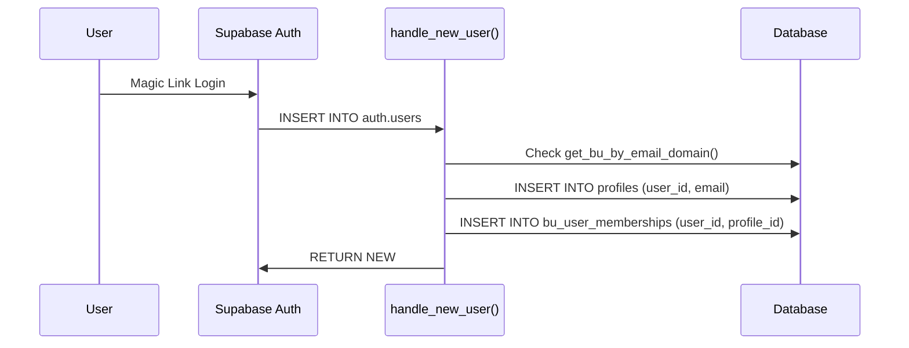
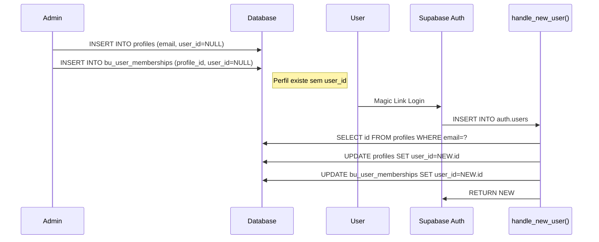

# Identity Unification v2.2 - Final Report

**Data:** 2026-01-09  
**Versão:** 2.2.0  
**Status:** ✅ Completo

---

## Resumo Executivo

A Identity Unification v2.2 implementou uma arquitetura profile-first para o Hub, preparando o sistema para suportar perfis pré-cadastrados (onboarding antes do primeiro login) enquanto mantém compatibilidade total com o sistema existente.

---

## Waves Implementadas

### Wave 1: Preparação ✅

**Objetivo:** Criar infraestrutura base para migração.

**Implementações:**
- Coluna `profiles.email` (canônica, substitui `work_email`)
- Índice único `idx_profiles_email_unique` em `email` onde `deleted_at IS NULL`
- Coluna `profiles.deleted_at` para soft delete
- Função `_identity_dual_mode_deadline()` retornando `2026-02-15`

**Backfill:** `profiles.email` populado a partir de `work_email`.

---

### Wave 2: Memberships ✅

**Objetivo:** Vincular memberships a profiles ao invés de users.

**Implementações:**
- Coluna `bu_user_memberships.profile_id` (FK → profiles.id)
- Coluna `bu_user_memberships.deleted_at` para soft delete
- `user_id` tornado nullable (suporte a perfis pré-cadastrados)
- Índices:
  - `idx_bu_memberships_profile_id` (profile_id onde deleted_at IS NULL)
  - `idx_bu_memberships_active_unique` (profile_id, bu_id) UNIQUE
  - `idx_bu_memberships_single_default` (profile_id) UNIQUE onde is_default=true

**Backfill:** `profile_id` populado a partir de `profiles.id` via `user_id`.

---

### Wave 3: Views ✅

**Objetivo:** Criar views canônicas para consultas profile-first.

**Views criadas:**

| View | Propósito | Security |
|------|-----------|----------|
| `v_profiles_directory` | Diretório global de perfis registrados | SECURITY INVOKER |
| `v_bu_memberships_active` | Memberships ativos por BU | SECURITY INVOKER |
| `v_bu_all_profiles_admin` | Admin view com computed_status | SECURITY INVOKER |
| `v_bu_active_profiles` | Compatibilidade com hooks existentes | SECURITY INVOKER |

---

### Wave 4: Funções SQL ✅

**Objetivo:** Criar funções profile-first canônicas.

**Funções criadas:**

| Função | Parâmetros | Retorno | Propósito |
|--------|------------|---------|-----------|
| `is_profile_bu_member` | (profile_id, bu_id) | BOOLEAN | Verifica membership (profile-first) |
| `is_profile_bu_admin` | (profile_id, bu_id) | BOOLEAN | Verifica admin (profile-first) |
| `get_profile_bus` | (profile_id) | TABLE | Lista BUs de um profile |
| `my_profile_id` | () | UUID | Retorna profile_id do auth.uid() atual |
| `profile_id_from_user_id` | (user_id) | UUID | Converte user_id → profile_id |

**Nota:** Funções existentes (`is_bu_member`, `is_bu_admin`) mantidas intactas pois têm ~70 RLS policies dependentes.

---

### Wave 5: Auth Hooks + Frontend ✅

**Objetivo:** Atualizar trigger de criação de usuário e hooks frontend.

**Implementações:**

1. **`handle_new_user()`** atualizado:
   - Cria membership com `profile_id` além de `user_id`
   - Suporta vinculação de perfis pré-existentes (importados via email)
   - Mantém retrocompatibilidade total

2. **`useUserBus`** atualizado:
   - Inclui `profile_id` na query
   - Filtra por `deleted_at IS NULL`
   - Seleciona apenas colunas necessárias

3. **`useIdentity`** atualizado:
   - Filtro `deleted_at IS NULL`
   - Retry em caso de falha temporária
   - Logging melhorado para debugging

---

### Wave 6: Documentação ✅

**Objetivo:** Documentar todo o sistema e criar scripts de auditoria.

**Documentos:**
- Este relatório (`IDENTITY_UNIFICATION_V2_REPORT.md`)
- Atualização do `IDENTITY_CONVENTION.md` (seção 11 adicionada)

---

## Arquitetura Final

```
┌─────────────────────────────────────────────────────────────────┐
│                     IDENTITY UNIFICATION v2.2                    │
├─────────────────────────────────────────────────────────────────┤
│                                                                  │
│  ┌──────────────────┐        ┌──────────────────────────────┐   │
│  │   auth.users     │        │       profiles               │   │
│  │  ├── id (PK)     │◄───────│  ├── id (PK) = profile_id    │   │
│  │  └── email       │  FK    │  ├── user_id (FK, nullable)  │   │
│  └──────────────────┘        │  ├── email (canônico)        │   │
│                              │  └── deleted_at              │   │
│                              └──────────────────────────────┘   │
│                                          │                       │
│                                          │ FK                    │
│                                          ▼                       │
│                              ┌──────────────────────────────┐   │
│                              │   bu_user_memberships        │   │
│                              │  ├── profile_id (FK) ←─NEW   │   │
│                              │  ├── user_id (nullable)      │   │
│                              │  ├── bu_id (FK)              │   │
│                              │  └── deleted_at              │   │
│                              └──────────────────────────────┘   │
│                                                                  │
├─────────────────────────────────────────────────────────────────┤
│                        VIEWS CANÔNICAS                           │
├─────────────────────────────────────────────────────────────────┤
│  v_profiles_directory      │ Diretório global (email unique)   │
│  v_bu_memberships_active   │ Memberships ativos por BU         │
│  v_bu_all_profiles_admin   │ Admin: todos os perfis + status   │
│  v_bu_active_profiles      │ Compatibilidade (backward compat) │
├─────────────────────────────────────────────────────────────────┤
│                     FUNÇÕES CANÔNICAS                            │
├─────────────────────────────────────────────────────────────────┤
│  my_profile_id()           │ Retorna profile_id do auth.uid()  │
│  is_profile_bu_member()    │ Verifica membership (profile-first)│
│  is_profile_bu_admin()     │ Verifica admin (profile-first)    │
│  get_profile_bus()         │ Lista BUs de um profile           │
└─────────────────────────────────────────────────────────────────┘
```

---

## Fluxos de Uso

### Novo Usuário (Domínio Autorizado)



### Perfil Pré-Cadastrado (Import)



---

## Checklist de Conformidade

| Item | Status | Notas |
|------|--------|-------|
| profiles.email único e canônico | ✅ | Índice único onde deleted_at IS NULL |
| bu_user_memberships.profile_id | ✅ | FK para profiles.id |
| Soft delete em profiles | ✅ | deleted_at column |
| Soft delete em memberships | ✅ | deleted_at column |
| Views profile-first | ✅ | 4 views criadas |
| Funções canônicas | ✅ | 5 funções criadas |
| handle_new_user atualizado | ✅ | Cria profile_id em memberships |
| useUserBus atualizado | ✅ | Inclui profile_id, filtra deleted |
| useIdentity atualizado | ✅ | Retry, logging melhorado |
| Documentação completa | ✅ | Este relatório |

---

## Próximos Passos (Pós-Deadline)

Após `2026-02-15` (deadline do dual-mode):

1. **Migrar RLS policies** para usar `is_profile_bu_member()` ao invés de `is_bu_member()`
2. **Remover fallbacks** de user_id em funções
3. **Deprecar** `is_bu_member(user_id)` e `is_bu_admin(user_id)`
4. **Limpar** tabela `_identity_migration_audit`

---

## Contatos

- **Responsável:** Engenharia Hub
- **Documentação:** docs/IDENTITY_CONVENTION.md
- **Scripts de Auditoria:** scripts/audit-identity-usage.ts

